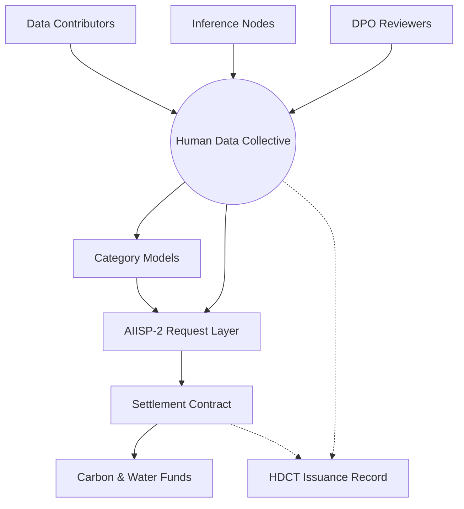
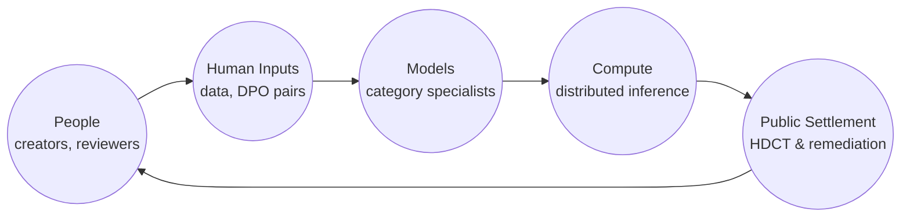
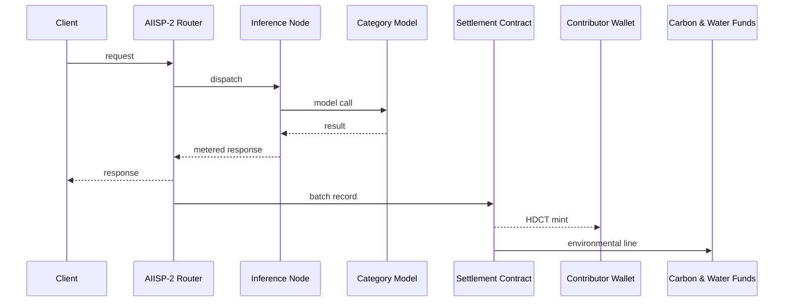

# The Human Data Collective: AI, Data, and Distributed Compute

*A contributor aligned inference standard for public good artificial intelligence*

Austin Harshberger  
Happy Stack Calculus · Los Angeles County  
`x@97115104.com` · <https://links.97115104.com>  
May 2026

## Abstract

Several of the biggest challenges plaguing the development and utilization of language models in 2026, notably bias, the difficulty of monitoring undesirable and illegal content, psychological safety risks associated with human led alignment, and severe environmental impact, can be partially or completely mitigated through the careful curation of high quality human generated data, more efficient models, and fair incentives. This second version of the Human Data Collective builds on the first [harshberger2026hdcv1] by removing any dependency on centralized frontier providers and adds a contribution layer of connected inference nodes. It proposes an approach to incentives that compensates contributors for their work through the Human Data Collective Token, and shifts to the use of smaller, more efficient language models, trained on category-specific datasets.

**Figure i. Human Data Collective v2 architecture**



*Figure note. This diagram shows HDC's v2 operating loop at the role level. Data contributors, inference nodes, and DPO reviewers supply accepted work; AIISP-2 routes ordinary model requests; settlement records HDCT issuance and environmental lines in the same public accounting surface.*

(c) 2026 Happy Stack Calculus LLC · Draft for public comment

## Contents

- [Preface and Author's Note](#preface-and-authors-note)
- [What Changed from Version 1](#what-changed-from-version-1)
- [1. AI and Inference in 2026](#1-ai-and-inference-in-2026)
- [2. Murky Data](#2-murky-data)
- [3. A Better Human Data Collective](#3-a-better-human-data-collective)
- [4. Distributed Inference and Model Constellations](#4-distributed-inference-and-model-constellations)
- [5. AIISP-2 Settlement](#5-aiisp-2-settlement)
- [6. Phased Adoption](#6-phased-adoption)
- [7. For Contributors](#7-for-contributors)
- [8. For Governments and Regulators](#8-for-governments-and-regulators)
- [9. For Everyone](#9-for-everyone)
- [10. AI as a Public Good](#10-ai-as-a-public-good)
- [11. Considerations](#11-considerations)
- [Appendix A. Tokenomics](#appendix-a-tokenomics)
- [Appendix B. Issuance and Cost Formulas](#appendix-b-issuance-and-cost-formulas)
- [Acknowledgements](#acknowledgements)
- [References](#references)

## Preface and Author's Note

This paper is written about, not yet with, the contributors and communities whose labor and lived experience give this proposal its motivating force; published reporting and the public record are its sources. It is a draft for public comment and not yet a ratified standard.

As the author of this paper, I believe a fair approach that incentivizes all would usher in an era of higher quality training inputs, resulting in higher quality outputs, making future language models more aligned with the best of humanity, that is community, creativity, culture, and equality, as opposed to the worst, isolation, extraction, marginalization, anxiety, and individualism. The mechanism for creating human generated data with shared incentives also creates a secondary marketplace for data generation, aggregation, and labeling, ushering in new job opportunities that fulfill the promise of AI as a public good which generates jobs, propping up human productivity and creativity. And, most importantly, by prioritizing and designing for environmental impact, it's possible to create a future where AI development is a positive driver in policy around sustainable tech regulation. My hope is that this proposal and similar standards move the line in an effort to give credit where it is due, and to amplify the voices of those whose contributions are often overlooked, and sometimes, silenced.

The first version of HDC outlined how generalist monolithic models are extremely costly across almost every vertical that matters. Most tasks don't require and often are suboptimally solved when a generalist human is assigned to them, why then, do we think, as an industry and consumers, that generalist models are the best approach? What is more valuable, I think, and is also represented by research from Apple and others, is specialized models tailored to specific tasks such as software development, where the skill and time required is high for a human but trivial for a model, and where outsized impact is clear with less risk of hallucinated data. By creating a system that enables category-specificity, it is possible to train specialists while reducing the cost of training and inference, and therefore, the cost to users, businesses, providers, and the environment.

This second version narrows the Human Data Collective to its mission, chiefly, to transition artificial intelligence into public good infrastructure where data, compute, and feedback layers compensate the people who supply them. Where version 1 asked frontier providers to adopt a more equitable approach to AI development and inference, this version focuses on the practical implementation of an independent decentralized community-driven constellation of category-specific models.

**Contributor Cycle Economy**



*Human contributions create models, distributed nodes serve inference, and settlement mints HDCT for each qualifying work event while routing environmental costs into public funds.*

**Implementation Premise**

```http
POST /v2/inference
X-AIISP-Category: writing
X-AIISP-Node: 0xA1B2...
X-AIISP-Settlement: batch
```

AIISP-2 is a thin inference layer that carries model category, serving node, energy benchmark, environmental line, and settlement batch identifier. Clients still receive a normal model response, and the network receives an auditable record of which node served the request.

HDCT issuance is event-based. A settlement contract mints after accepted data, verified inference, or DPO feedback enters the network.

*Optionally read by role.* Contributors should start with [A Better Human Data Collective](#3-a-better-human-data-collective) and [For Contributors](#7-for-contributors); engineers should start with [Distributed Inference and Model Constellations](#4-distributed-inference-and-model-constellations) and [Appendix B](#appendix-b-issuance-and-cost-formulas); policy staff should start with [For Governments and Regulators](#8-for-governments-and-regulators) and [Considerations](#11-considerations); readers familiar with the first version should start with [A Better Human Data Collective](#3-a-better-human-data-collective), where the v2 token and compute changes are introduced.

## What Changed from Version 1

The previous version of HDC was an exhaustive account of the 2026 AI landscape and a detailed proposal for how frontier providers might expose request level cost lines, route premium inference revenue to contributors, and fund environmental remediation. This version keeps the public benefit claim and the accounting surface, while changing the paper's style and starting point. HDC is now presented as a shorter contributor aligned inference layer, with a new direct contribution incentive mechanism through the network's native token, HDCT, issued for data contributions, served inference requests, and DPO pairs.

V1 should be read as the longer technical and historical record, in that sections 1--4 and 6--10 give fuller detail on the current AI landscape, request lifecycle, California policy sketch, environmental accounting, and open questions. V2 briefly reiterates many of those claims for readability.

Base[^base] remains the intended home for HDCT, but its implementation detail is left out for simplicity. V2 relies on optional footnotes, providing additional detail where helpful, shortening the paper while leaving follow-up paths for readers. The glossary of terms and index of named persons and organizations are also omitted from this version for brevity, many of the same references and sources are used in both versions so v1's glossary and index remain sufficient for readers who want a fuller research trail.

**Version shift diagram**

| v1 | shift | v2 |
| --- | --- | --- |
| provider-facing adoption; AIISP-1 request disclosure | economic center shifts | shared contribution layer; AIISP-2 routing and settlement |
| creator-share pools; premium-line split; provider cadence | simplifies into | HDCT issuance; accepted work event; public ledger record |
| provider-hosted compute; model owner as counterparty; voluntary pilot | moves toward | interoperable inference; contributors as participants; network bootstrap |
| carbon and water funds; public environmental line; California pathway | carries forward | environmental line continued; category gating; shared remediation records |

It is helpful to read the diagram above as a change in approach, where v1 tried to solve many problems at once through a detailed provider facing standard, v2 narrows the design and argument of HDC so a reader can see the mechanism quickly, outlining how accepted work creates a public record, mints HDCT, is used for training a network of category-specific models, and, finally, served through the network's interface workers.

## 1. AI and Inference in 2026

Language models[^llm] are the data that was used to create them [bender2021parrots]. This framing draws directly on Bender, Gebru, McMillan-Major, and Shmitchell's *Stochastic Parrots*,[^parrots] which argued that data used to train language models encodes the social and economic conditions of the places and environments in which they were collected, replicating the same often problematic and biasing patterns. If frontier LLMs are trained on public repositories, Wikipedia, personal websites, platform archives, and creator economies built by millions of people, why do the largest model providers privatize the resulting capability created from publicly accessible content and sell access back to the people whose work made it possible?

Centralization exacerbates access and cost inequality further by placing pricing in the hands of the same firms that control model weights.[^weights] OpenAI was founded as a non-profit research company with an explicit mission to benefit humanity as a whole [openai2015intro], Anthropic was launched as a public benefit corporation focused on artificial intelligence safety and the long-term interests of society [anthropic2021intro], yet neither fully adhere to their stated mission and have since become megacorporations with the same for-profit mechanisms as every other corporation today and in the past. In practice, the most widely used frontier assistants, chiefly Claude and ChatGPT, are closed systems,[^closed] making the downstream developer, teacher, researcher, or small business, now increasingly dependent on these tools as a result of pervasive and widespread adoption, a price taker[^price-taker] on a contract unilaterally set by the model provider and yet further increased by the various platforms that route to it, creating a precarious environment for the businesses and end users who depend on it.[^github-copilot]

Karen Hao's *Empire of AI*[^empire] documents AI megacampuses targeting on the order of 1,000 to 2,000 megawatts of dedicated power, roughly equivalent to one-and-a-half and two-and-a-half times the energy demand of the entire city of San Francisco, with water inequity already visible in places such as Cerrillos, Chile, an arid region with scarce access to water. MOSACAT, the community water and territory organization in Cerrillos, obtained Google's environmental filing for a planned data center drawing 169 liters of fresh drinking water per second, enough to fill an Olympic-sized swimming pool every four hours, then used the filing to challenge Google's project, eventually causing Google to relocate to Canelones, Uruguay, at the time experiencing its worst drought in over 70 years. Sonia Ramos's account from the Atacama, where lithium and data center expansion are tied to traditional water source loss and the reported local extinction of native flamingo populations, outlines the same issue more plainly [hao2025empire, ch. 12]:

> *"Chile emits no more than 3 percent of the planet's emissions, but we are the ones paying the consequences for others. That is what I call territorial injustice."*
>
> Sonia Ramos, Lickanantay water defender, Atacama [iied2024ramos]

On the financial side of things, Crunchbase reported approximately US$300 billion in global venture funding in the first quarter of 2026, with approximately US$242 billion flowing to AI companies [crunchbase2026q1], while the Stanford Institute for Human-Centered Artificial Intelligence records a broader trend of concentrated private AI investment in the United States [stanfordhai2025index].

## 2. Murky Data

AI's frontier race is also a race against the exhaustion of usable data.[^exhaustion] Scaling laws[^scaling] establish that model quality is strongly related to the volume and distribution of training data and compute [kaplan2020scaling], and Patel and Leech's oral history[^scaling-era] records the same premise from those who built the present generation of frontier models [patel2025scaling]. Synthetic data generated by prior models introduces its own issues, with Shumailov and co-authors[^collapse] showing that recursively generated data can collapse the underlying distribution across training generations, reducing model quality [shumailov2024modelcollapse].

Murky data's costs are visible across bias, factual reliability, and labor. *Stochastic Parrots* documented the representational harms embedded in uncurated internet scale training data [bender2021parrots], OpenAI's GPT-4o system card reports continuing hallucination and safety limitations [openai2024gpt4osystemcard], and Kalai, Nachum, Vempala, and Zhang[^hallucination] formalized why models trained under standard objectives are statistically rewarded for guessing [kalai2025whyhallucinate]. The cost to those who work with murky data is even more direct a problem, as Hao's account of OpenAI's Sama contract describes, where Kenyan workers, paid on the order of US$1.32 to US$2.00 per hour to read and label violent and sexually explicit material, reported psychological injury following their efforts to improve ChatGPT and other models, through reinforcement learning from human feedback [hao2025empire, ch. 9].

## 3. A Better Human Data Collective

Vast reserves of high quality human data remain outside current training sets because no equitable and sustainable mechanism currently exists. Creator economies on platforms including YouTube, Twitch, Substack, Patreon, OnlyFans, Udemy, and LinkedIn Learning contain category rich and often expert human generated data, produced by people who are already familiar with payment for their work and could opt into a protocol that compensates them fairly. A public contribution record and issuance standard would be immensely valuable as it would make clean, humane data, usable with permission, compensation, and provenance.

This second version of HDC proposes a contributor aligned network for producing, serving, and improving AI systems through several contribution classes that cover human data, distributed inference, and direct preference optimization feedback.[^dpo] A person or group can contribute data through a public contribution record, run distributed hardware that serves inference, or provide DPO pairs through review tasks. Each accepted contribution creates an auditable event minting Human Data Collective Tokens and removing complicated recurring royalty machinery from its first version. As the network grows, the value of these tokens will increase, providing a return on investment for contributors.

**Table 1. HDCT issuance events. Each row maps a verified work event to HDCT issuance.**

| Event | Verifier | Mint trigger |
| --- | --- | --- |
| Data contribution | data reviewers | accepted contribution |
| Inference served | routing contract | verified metered response |
| DPO pair | feedback reviewers | accepted preference pair |

The Human Data Collective Token (HDCT) is best understood as an ownership adjacent speculative token, with the closest economic analogy being a share of stock in a high risk enterprise.[^erc20] An equity share of a publicly listed company, on, for example, the New York Stock Exchange, prices expected future revenue, governance, liquidity, and market belief at the time of issuance and is similar to HDCT, in that HDCT gives its holders economic exposure to future network value. If the network serves more inference, attracts better data, and earns trust as a public standard, HDCT will rise in market value with distributable surplus paid to holders under a dividend policy; if the network fails to attract contributors, compute, or customers, HDCT could be worth little or nothing in the same way a company stock might.[^tokenomics-note]

HDC's mission is to turn contribution into compensated participation and participation into broader public access as a new form of public good. V2 makes the value proposition of HDC clearer than v1 by building a shared contribution layer with records that are easily auditable in a single package familiar to existing companies without the need for a separate royalty or revenue sharing contract.

## 4. Distributed Inference and Model Constellations

HDC's v2 architecture starts from a portfolio view of artificial intelligence,[^portfolio] in which useful products can combine category-specific models, larger general systems, retrieval, symbolic tools, and distributed serving. Philosophical and empirical literature increasingly supports this view, with connectionist neural networks augmented by symbolic tools, retrieval systems, and category-specific routing [milliere2024philosophy]. Apple's OpenELM work shows that carefully designed small language models can produce measurable gains over comparable open baselines while using fewer pre-training tokens and releasing the training framework openly [openelm2024]. Apple's later work on reasoning models also cautions that larger inference budgets do not automatically yield dependable compositional reasoning across complexity thresholds [shojaee2025illusion]. This evidence points to a structural conclusion that a public standard should support a constellation of specialized models alongside larger generalist frontier models.

As an alternative to the extreme costs of maintaining a single, large-scale inference system, distributed inference offers a more scalable and cost-effective approach.[^distributed] Red Hat's 2026 account of distributed inference describes model and data parallelism, prefill-decode disaggregation, prefix aware routing, and failover across heterogeneous accelerators [redhat2026distributed], while BentoML's infrastructure work distinguishes the global routing problem across regions and providers from the local serving problem inside a single cluster [bentoml2025distributed]. These are the primitives the Collective plans to adapt for contributor operated GPUs, data center accelerators contributed under contract, and edge devices that can serve smaller category models. AIISP-2 routing assigns requests to the category model and serving node best positioned to answer them.

A category-specific model[^category-model] that runs locally or on a small cluster can answer many business and consumer requests at lower latency and marginal energy cost than a frontier scale generalist, while still escalating to larger models when the request requires it, and is therefore more economically viable while improving speed and in some cases, determinism.[^determinism] Public energy metering and carbon accounting tools such as CodeCarbon and the Lacoste, Luccioni, Schmidt, and Dandres methodology provide starting points for per request estimation [codecarbon2024; lacoste2019mlco2]. Similar to v1, the Collective's v2 design treats environmental footprint as a measurable request property, prices it into each request, and routes remediation in the same public record that mints HDCT.

## 5. AIISP-2 Settlement

AIISP-2[^aiisp] is a thin inference and settlement standard layered over ordinary HTTP-based model calls. A client supplies a model category, the routing layer selects a serving node, the node returns a response with metered token and energy records, and the settlement contract records the batch in which the request was served. AIISP-2 makes clear which node supplied the compute, what energy benchmark was applied, what environmental line was accrued, and whether the event qualified for HDCT issuance.

**Figure 1. AIISP-2 request path**



*Figure 1. AIISP-2 request path. Users receive a normal response, while the public settlement layer records the serving node, environmental line, and any HDCT issuance event.*

Each request has several specified accounting lines, namely a compute line that pays the serving node in the unit specified by the network's pricing schedule, an environmental line that accrues to carbon and water remediation funds, and an issuance line that determines whether the event qualifies for HDCT minting. In the case of inference, HDCT minting occurs per verified served request or settled unit of service, depending on the batching rule chosen in the companion technical specification. In the case of data and DPO feedback, minting occurs when a contribution is accepted into HDC's data registry.[^issuance-growth]

HDC's environmental line carries forward the strongest part of version one and also treats verified carbon retirement, water restoration, and direct grants to affected communities as separate accounting destinations, with public ledgers for inflows, retirements, and grant decisions.

## 6. Phased Adoption

HDC releases capability in stages so data, compute, and feedback can grow iteratively. Phase one, bootstrapping, establishes the contributor registry, the AIISP-2 reference implementation, the first few category datasets, and a small fleet of contributor operated or Collective owned GPUs serving open weight models. Phase two, category release, trains specialized models for learning, software development, writing, and creative arts, with retrieval and public evaluation used where they improve reliability. Phase three, gated category release, adds domains that require age, identity, or credential checks, including adult content and categories such as professional advice. Final wholesale release offers retail and business customers a stable inference endpoint with public pricing, pinned model snapshots, and auditable service records.

Bootstrapping the Human Data Collective will be difficult. Encouraging contributors to provide data, inference, and feedback will take time, effort, and trust. Training and serving the first category-specific models will require resources before operating revenue exists, so the first phase depends on an initial genesis mint of HDCT, public interest grants, compute pre-commitments, and contributors who accept uncertain HDCT payouts before market capitalization. A credible bootstrapping plan needs externally legible milestones, including a working AIISP-2 implementation, at least 1,000 verified contributors or beta sign-ups, a first category-specific model when data permits, and a measurable inference workload served by contributor nodes.

An acceptable state of the Collective might look something like a business customer paying a predictable rate for inference, built against a named model snapshot with service commitments and an auditable public settlement history behind a publicly accessible API. In this example, data would continue to grow with new contributors, compute would grow with new operators, and feedback would grow with new DPO reviewers, with each new unit of accepted work minting HDCT into the hands of the person or group that supplied it. A future successful state of the Collective might include a contributor base on the order of 10,000, sustained inference throughput on the order of $10^{9}$ tokens per day, a category of models competitive with an open weight baseline at a parameter count on the order of $10^{9}$, cumulative HDCT issuance that exceeds comparable human feedback compensation on equivalent workloads, and a market capitalization that allows for sustainable growth and dividend payouts for HDCT holders.

## 7. For Contributors

Language models are the data that was used to create them, and the Collective is a new way for the people who create, curate, and serve that data to earn from their work. HDC's public contribution method is the core of the network's value proposition as it links work to compensation and possible future upside.

From the perspective of a contributor, the Collective is a new way to earn from creative and technical skills, humane review work, and underutilized hardware such as GPUs or servers. HDC's public contribution record is a new kind of resume, portfolio, and financial opportunity rolled into one, with the potential to be more inclusive than existing labor markets and does not have the same gatekeeping, credentialing, or application process as traditional jobs, offering an alternative to the often unfair and now increasingly competitive job markets of 21st century life.

A writer, programmer, teacher, artist, sex worker, translator, or indigenous knowledge holder can contribute only the categories of work they choose, keep ownership of the underlying work, and receive HDCT when their contribution is accepted. HDCT can then be converted into other assets or into fiat currency such as USD, or foreseeably used to take part in network governance. A compute operator can contribute verified GPU capacity and receive HDCT for each settled inference request their worker completes, as a new form of mining similar to Bitcoin. A reviewer can provide feedback and analysis, receiving HDCT for each accepted DPO pair, improving the quality of language models and being rewarded in the process. A future state of the Collective might enable improved data quality and compute by providing a means to stake HDCT, making it so contributors of all types can earn rewards similar, in effect, to a perpetual royalty, for as long as they choose to stake their earnings.

As mentioned in [Murky Data](#2-murky-data), current systems route much of their labeling, moderation, and preference work through contractors with very low wages and minimal control over the models they improve [hao2025empire, ch. 9]. HDC aligns with fair work principles promoted by the Oxford Internet Institute's Fairwork project and with Lanier and Weyl's data dignity argument, and treats contributors as participants in the network's capital structure [lanier2018dignity].

## 8. For Governments and Regulators

HDC adds an evidentiary surface that many current systems lack. California Assembly Bill 2013 requires developers of covered generative AI systems to disclose information about training data [ab2013ca], and privacy acts such as the California Consumer Privacy Act give individuals rights over personal information that may appear in training or service pipelines [ccpa2018]. A registry of categorized data and verified contributions is the kind of record such laws need, as it permits model capabilities to be traced back to data categories, contributor permissions, and takedown procedures. HDC's design gives regulators a public supply chain record before the model is served, with auditability built in.

Categories such as adult content, medical advice, legal advice, regulated science, and other restricted domains can be marked at the data layer and served only through models whose inference path cryptographically[^crypto] enforces age, identity, or credential requirements. Lawful enforcement becomes part of the network's operating assumptions, including court orders, tax obligations on token issuance, copyright claims, and jurisdiction-specific restrictions on content.

## 9. For Everyone

HDC's contribution layer is public infrastructure for the next generation of artificial intelligence. A creator can decide which work enters the data registry and receive HDCT when accepted; a student, teacher, researcher, or small business can buy inference through a route whose price is reliable and environmental accounting is visible; a frontier lab employee, public servant, translator, displaced tech worker, creative, and infrastructure vendor can contribute expertise as a source of supplemental income while improving publicly accessible AI in the process. HDC adds value because it links all these different types of contributors and skillsets through a single contribution record, settlement surface, and token whose upside depends on the network becoming useful. HDC's design remains open, so anyone who contributes data, compute, feedback, protocol work, institutional support, or early capital can see the results of their efforts in the network's growth, and can be rewarded for it while widening distributed access.

## 10. AI as a Public Good

HDC's public good end state begins with an ordinary request. A nurse in a county clinic asks a specialist model to draft follow-up instructions, a student asks for a second explanation of a hard problem, a mechanic asks for a wiring note, a small business asks for an invoice workflow, and a tribal office asks for language support built from data contributed with permission. Each response arrives through an endpoint, application, or help desk that already makes sense to the user, while the record behind it shows the category model that served the request, the node that supplied compute, which environmental line was charged, and which contributors earned HDCT because their work made the answer possible.

A mature Collective would create entirely new job functions. Data gardeners would cultivate new resources; preference editors would turn their unique perspective into DPO feedback pairs; category stewards would create new fields of specialized learning and shared intelligence; inference operators would run the infrastructure that makes the Collective possible; model librarians would help customers find the subject-matter experts that fit their needs by accessing the Collective's model archive. These are ordinary jobs in a society that has accepted AI as a common good, with training paths, public standards, and compensation attached to their work. A contributor could be one person with a single idea, or a classroom, guild, creator cooperative, clinic, union, small business, or research group with many shared ideas.

A new marketplace that follows would be more humane than today's scrape and privatize data pipelines. A musician could offer labeled chord progressions for a teaching model, a water district could update remediation records for a watershed model, a legal aid group could train a forms assistant, elder care workers could maintain a bingo and bridge bot, and a city could fund a permitting model whose errors are measured publicly. Small models would become specialists that carry routine memory, drafting, retrieval, translation, checking, and explanation, while doctors, lawyers, artists, teachers, engineers, and public servants receive specialized tools that help and augment their existing roles, while judgment and responsibility remain with them. Frontier laboratories remain part of the larger field in this picture, with their general models, research, and APIs complemented by a contribution aligned route for everyday inference.

HDC's long horizon is a public utility for intelligence with a sustainable, fair, and equitable economic model. Businesses pay for reliable inference, institutions and individuals pay for category-specific tools, and developers build on stable endpoints. Revenue from the Collective funds reserves, pays employees, distributes dividends, helps with environmental remediation, and flows back to the creators, maintainers, and early adopters who helped make it possible; the network grows by widening participation, making work visible, creating new jobs, and ultimately results in more opportunities for everyone to participate and benefit from AI as a public good.

## 11. Considerations

This v2 design has open questions that will be answerable when the network achieves real use. Legal classification comes to mind first, as a token whose market value behaves like a speculative share will likely be treated by regulators as a security or another regulated instrument, depending on jurisdiction and final governance design. Verification fraud follows, including identity fraud, prompt laundering through intermediate models, and collusion that inflates measured contribution. Contributor identity, contribution scoring, and model assisted work disclosure require a complete adversarial design before the network can safely scale.

Synthetic data is the third open question. Model collapse applies to the Collective's pipeline as much as it does to the pipelines of frontier providers, so if its contributor base floods its data with model assisted output, the Collective's model quality could degrade.[^model-collapse] Public contribution records give the network a measurement surface, and measurement is only the first step. Environmental legitimacy remains open because public carbon and water ledgers matter only when credits and grants correspond to real remediation in affected communities. Governance capture remains open as well, because a token-weighted system can reproduce the concentration it was created to oppose unless contribution, treasury, and voting rules are designed with that risk in view.

Related staking and governance questions sit behind concepts HDC and HDCT might bring to life, such as what I'd call PoAIC or Proof of AI Contribution. Future versions of HDC could enable contributors to lock earned HDCT as Proof of Data Contribution, Proof of Feedback, or Proof of Inference, creating quality bonds that could help the network weigh records and give contributors another revenue stream or governance rights; v2 leaves this out for now, as utility is unclear and would increase complexity.

## Appendix A. Tokenomics

This appendix states the preliminary tokenomics of the Human Data Collective Token. HDC's genesis mint is $G=1,000,000$ HDCT, with forty percent reserved for initial capital formation, thirty percent reserved for hardware and early contributor incentives, and thirty percent reserved for operating expenses.

| Genesis use | HDCT | Share |
| --- | ---: | ---: |
| Initial capital formation | 400,000 | 40% |
| Hardware and early incentives | 300,000 | 30% |
| Operating reserve | 300,000 | 30% |

HDCT is modeled as a stock type instrument, subject to final legal structure and regulatory treatment. If $S_t$ is the fully diluted supply at time $t$ and holder $i$ owns $h_i$ tokens after vesting and lockups, holder $i$'s economic share is $h_i/S_t$. Public companies provide the closest analogy because they issue equity, distribute board authorized dividends, repurchase shares, and trade through regulated venues [sec2023repurchases]. Where legally permitted, HDCT could trade through exchange providers or brokered private venues, with transfer restrictions, disclosure rules, and any future inference discounts or category access rights fixed before public listing.

HDCT's starting distribution target is an annualized two percent yield, paid quarterly when revenue, reserve policy, and law permit. This target sits near mature public company dividend practice, with Apple, Microsoft, NVIDIA, and S&P Dow Jones Indices providing useful comparisons [apple2026dividend; microsoft2026dividend; nvidia2025q3; spglobal2026dividends]. HDCT should follow the same disclosure instinct, with distributions paid from actual surplus and not guaranteed:

$$
D_{\mathrm{pool}}=\min(0.02\,P_{\mathrm{ref}}S_{\mathrm{eligible}},\,\rho R_{\mathrm{net}}),
$$

where $P_{\mathrm{ref}}$ is a reference market price, $S_{\mathrm{eligible}}$ is dividend-eligible supply, $R_{\mathrm{net}}$ is net distributable network revenue, and $\rho$ is the share of that revenue approved for distribution after reserves. Holder $i$ then receives $(h_i/S_{\mathrm{eligible}})D_{\mathrm{pool}}$.

Contribution based issuance means supply grows after genesis as accepted data, verified inference, and accepted DPO pairs enter the network. V2's capital return policy is a dividend plus buyback ladder, in that net revenue first fills published reserves, eligible holders then receive quarterly distributions up to the target, and remaining distributable surplus pays for HDCT repurchases. Repurchased HDCT is either retired or treasury locked under a published rule:

$$
S_{t+1}=S_t+E_t-B_t,
$$

where $E_t$ is new contribution issuance during the period and $B_t$ is HDCT bought back, retired, or treasury locked from distributable surplus. This rule gives the network a crypto native supply drain while preserving the stock market intuition that per token value can rise when market capitalization grows faster than dilution, without promising appreciation.

Two open questions remain, namely whether $E_t$ should be constrained by an epoch level issuance budget tied to revenue, inference volume, data quality, or some weighted combination of the three, and whether contributors should be allowed to lock earned HDCT in a Proof of AI Contribution (PoAIC) mechanism. A useful external analogy is staking in networks where participants earn rewards while accepting protocol risk, such as Aave's Safety Module and Umbrella design [aave2026umbrella], although PoAIC would be tied to verified work. PoAIC's design question is whether it should become a voluntary worker tier, a node quality bond, or a separate non-transferable reputation score, and if it would provide any additional governance rights.

## Appendix B. Issuance and Cost Formulas

This appendix collects the minimal formulas implied by the v2 design. Let $D$ be an accepted data contribution, $I$ be a verified inference event or settled inference unit, and $F$ be an accepted direct preference optimization pair. HDCT's mint function is

$$
M_{\mathrm{HDCT}} = m_D(D) + m_I(I) + m_F(F),
$$

where each term is evaluated against the event identifier recorded on the public ledger. Later contribution value is expressed through the market price of HDCT, and a recorded event cannot be reminted.

For a single inference event, let $C_{\mathrm{user}}$ be the user facing charge, $C_{\mathrm{node}}$ the compute payment, $C_{\mathrm{env}}$ the environmental line, and $C_{\mathrm{treasury}}$ the treasury allocation. Settlement identity is

$$
C_{\mathrm{user}} = C_{\mathrm{node}} + C_{\mathrm{env}} + C_{\mathrm{treasury}} + C_{\mathrm{reserve}},
$$

where $C_{\mathrm{reserve}}$ covers reserve, insurance, or liquidity functions. HDCT issuance is separate from this cash decomposition and attaches to the accepted work event.

For environmental accounting, let $e_{\mathrm{req}}$ be estimated kilowatt hours, $R_{\mathrm{kWh}}$ the region-specific electricity rate, $\gamma$ the carbon remediation factor, and $\omega$ the water remediation factor. A representative line is

$$
C_{\mathrm{env}} = R_{\mathrm{kWh}} e_{\mathrm{req}} + \gamma + \omega,
$$

with $\gamma$ and $\omega$ calibrated against published remediation instruments or direct community grant budgets. All figures are illustrative until AIISP-2 publishes reference benchmarks.

## Acknowledgements

This paper owes a substantial intellectual debt to Karen Hao's *Empire of AI* [hao2025empire], whose investigation of OpenAI, its capital structure, labor supply chain, and the communities affected by its physical build out is drawn on throughout, and to the workers and community organizers whose testimony it records, particularly Sonia Ramos in the Atacama and the organizers of MOSACAT in Cerrillos. HDC v2 also owes a debt to Dwarkesh Patel and Gavin Leech for *The Scaling Era* [patel2025scaling], whose oral history of the field provided the practitioners' own framing of scaling laws, data curation, and human feedback bottlenecks.

This research also rests on the published work of researchers whose findings this paper draws on directly, including Emily M. Bender, Timnit Gebru, Angelina McMillan-Major, and S. Shmitchell for *On the Dangers of Stochastic Parrots* [bender2021parrots]; Adam Tauman Kalai, Ofir Nachum, Santosh S. Vempala, and Edwin Zhang for the formal account of why language models hallucinate [kalai2025whyhallucinate]; Jared Kaplan and co-authors for scaling laws [kaplan2020scaling]; Ilia Shumailov and co-authors for model collapse [shumailov2024modelcollapse]; S. Mehta and co-authors for Apple's OpenELM small language model work [openelm2024]; Emma Strubell, Ananya Ganesh, and Andrew McCallum for early work on the energy footprint of language model training [strubell2019energy]; and Jaron Lanier and E. Glen Weyl for the data dignity framing [lanier2018dignity].

Finally, as in the first version of HDC, I would like to thank my friends and family for their unwavering support and feedback on this and countless other projects. It would not be possible without you ♡

---

*with gratitude*

---

*For everyone whose work, words, and care went into this paper without a byline, the moderator who tagged a post, the analyst who labelled a dataset, the reviewer who flagged harm, the activist who filed a records request, the engineer who fixed it on a weekend, the parent who covered an evening, and the one who stayed up late to help, the friend who read a draft and said it could be clearer, and the family member who did the same. If a future version of this proposal reaches you, the credit is all yours. Any errors that remain are mine alone.*

A. H.  
Los Angeles County, May 2026

**HDC mark:** D, H, and C arranged as a three-node public contribution symbol, labelled `human data collective`.

**attest `v3.0`** `2026-04-29-2a1e24`

*Human-directed AI collaboration.*

| Field | Value |
| --- | --- |
| Content | `paper/v2/human-data-collective-v2.tex` |
| Author | Austin Harshberger |
| Model | GPT-5 Codex, collaborated, Codex CLI |
| Role | revision, typesetting, verification, and layout support |
| Method | human-selected edits applied directly in LaTeX and rebuilt with `pdflatex` |
| Timestamp | 2026-04-29T21:05:52.472Z |
| Signature | HMAC-SHA256 `650a2187...d8fa8fc` |
| Verify | <https://attest.97115104.com/s/574l69nm> |

**Colophon.** Set in Computer Modern with LaTeX on macOS. Drafted, revised, and typeset between November 2025 and May 2026 with the assistance of GPT-5 Codex under human direction. Released for public comment under CC BY 4.0; the AIISP-1 and AIISP-2 reference implementations are released under the MIT Licence.

## References

[ab2013ca] California State Legislature. Assembly Bill 2013: Generative Artificial Intelligence -- Training Data Transparency. Chapter 817, Statutes of 2024, approved September 28, 2024. <https://leginfo.legislature.ca.gov/faces/billTextClient.xhtml?bill_id=202320240AB2013>

[aave2026umbrella] Aave. Stake in Umbrella and the Safety Module. 2026. <https://www.aave.org/help/umbrella/stake>

[anthropic2021intro] Anthropic. Anthropic: Company. 2021. <https://www.anthropic.com/company>

[apple2026dividend] Apple. Dividend History. 2026. <https://investor.apple.com/dividend-history/default.aspx>

[bender2021parrots] E. M. Bender, T. Gebru, A. McMillan-Major, and S. Shmitchell. On the dangers of stochastic parrots. *Proceedings of the 2021 ACM Conference on Fairness, Accountability, and Transparency*, pp. 610--623, 2021. <https://doi.org/10.1145/3442188.3445922>

[bef2024wrc] Bonneville Environmental Foundation. Water Restoration Certificates. 2024. <https://www.b-e-f.org/programs/water-restoration-certificates/>

[bentoml2025distributed] BentoML. What is distributed inference? 2025. <https://bentoml.com/llm/infrastructure-and-operations/distributed-inference>

[ccpa2018] California State Legislature. Assembly Bill 375: California Consumer Privacy Act of 2018. Chapter 55, Statutes of 2018, codified at Cal. Civ. Code §§ 1798.100--1798.199. <https://leginfo.legislature.ca.gov/faces/codes_displayText.xhtml?division=3.&part=4.&lawCode=CIV&title=1.81.5>

[codecarbon2024] B. Courty, V. Schmidt, et al. CodeCarbon: estimate and track carbon emissions from compute. 2024. <https://github.com/mlco2/codecarbon>

[crunchbase2026q1] G. Teare. Q1 2026 shatters venture funding records as AI boom pushes startup investment to $300B. *Crunchbase News*, April 1, 2026. <https://news.crunchbase.com/venture/record-breaking-funding-ai-global-q1-2026/>

[github2026usagebilling] M. Rodriguez. GitHub Copilot is moving to usage-based billing. *The GitHub Blog*, April 27, 2026. <https://github.blog/news-insights/company-news/github-copilot-is-moving-to-usage-based-billing/>

[harshberger2026hdcv1] A. Harshberger. *The Human Data Collective: A Standard for Open, Sustainable, and Equitable Artificial Intelligence*. Happy Stack Calculus, April 2026. <https://github.com/97115104/aiisp-spec/blob/main/paper/v1/human-data-collective.pdf>

[hao2025empire] K. Hao. *Empire of AI: Dreams and Nightmares in Sam Altman's OpenAI*. Penguin Publishing Group, 2025.

[iied2024ramos] International Institute for Environment and Development. Energy transition, community fragmentation and territorial justice: an interview with Sonia Ramos. April 2024. <https://www.iied.org/energy-transition-community-fragmentation-territorial-justice-interview-sonia-ramos>

[jobs1997thinkdifferent] TBWA\Chiat\Day (R. Siltanen and K. Segall, copy) for Apple Computer, narrated by S. Jobs. *Think Different ("Here's to the Crazy Ones")*, broadcast and print campaign, 1997. Full text: <https://www.thecrazyones.it/spot-en.html>

[kalai2025whyhallucinate] A. T. Kalai, O. Nachum, S. S. Vempala, and E. Zhang. Why language models hallucinate. arXiv:2509.04664, 2025. <https://arxiv.org/abs/2509.04664>

[kaplan2020scaling] J. Kaplan et al. Scaling laws for neural language models. arXiv:2001.08361, 2020. <https://arxiv.org/abs/2001.08361>

[lacoste2019mlco2] A. Lacoste, A. Luccioni, V. Schmidt, and T. Dandres. Quantifying the carbon emissions of machine learning. arXiv:1910.09700, 2019. <https://arxiv.org/abs/1910.09700>

[lanier2018dignity] J. Lanier and E. G. Weyl. A blueprint for a better digital society. *Harvard Business Review*, September 2018. <https://hbr.org/2018/09/a-blueprint-for-a-better-digital-society>

[milliere2024philosophy] R. Milliere and C. Buckner. A philosophical introduction to language models, part I: continuity with classic debates. arXiv:2401.03910, 2024. <https://arxiv.org/abs/2401.03910>

[microsoft2026dividend] Microsoft. Microsoft announces quarterly dividend. March 10, 2026. <https://news.microsoft.com/source/2026/03/10/microsoft-announces-quarterly-dividend-28/>

[nvidia2025q3] NVIDIA. Quarterly Report on Form 10-Q for the quarterly period ended October 26, 2025. 2025. <https://investor.nvidia.com/files/doc_financials/2026/q3/13e6981b-95ed-4aac-a602-ebc5865d0590.pdf>

[openai2015intro] OpenAI. Introducing OpenAI. 2015. <https://openai.com/index/introducing-openai/>

[openai2024gpt4osystemcard] OpenAI. *GPT-4o System Card*. 2024. <https://openai.com/index/gpt-4o-system-card/>

[openelm2024] S. Mehta et al. OpenELM: an efficient language model family with open training and inference framework. arXiv:2404.14619, 2024. <https://arxiv.org/abs/2404.14619>

[patel2025scaling] D. Patel and G. Leech. *The Scaling Era: An Oral History of AI, 2019--2025*. Stripe Press, 2025.

[redhat2026distributed] Red Hat. What is distributed inference? April 15, 2026. <https://www.redhat.com/en/topics/ai/what-is-distributed-inference>

[sec2023repurchases] U.S. Securities and Exchange Commission. SEC adopts amendments to modernize share repurchase disclosure. Press Release 2023-85, May 3, 2023. <https://www.sec.gov/newsroom/press-releases/2023-85>

[shojaee2025illusion] P. Shojaee, I. Mirzadeh, K. Alizadeh, M. Horton, S. Bengio, and M. Farajtabar. The illusion of thinking: understanding the strengths and limitations of reasoning models via the lens of problem complexity. arXiv:2506.06941, 2025. <https://arxiv.org/abs/2506.06941>

[shumailov2024modelcollapse] I. Shumailov et al. AI models collapse when trained on recursively generated data. *Nature*, 631:755--759, 2024. <https://doi.org/10.1038/s41586-024-07566-y>

[spglobal2026dividends] S&P Dow Jones Indices. S&P 500 Dividends. January 7, 2026. <https://www.spglobal.com/spdji/en/documents/index-news-and-announcements/20260107-spdji-dividends.pdf>

[stanfordhai2025index] Stanford Institute for Human-Centered Artificial Intelligence. *The 2025 AI Index Report*. 2025. <https://hai.stanford.edu/ai-index/2025-ai-index-report>

[strubell2019energy] E. Strubell, A. Ganesh, and A. McCallum. Energy and policy considerations for deep learning in NLP. *Proceedings of the 57th Annual Meeting of the Association for Computational Linguistics*, pp. 3645--3650, 2019. <https://doi.org/10.18653/v1/P19-1355>

[terrapass2026wrc] Terrapass. The 2026 complete guide to water credits and Water Restoration Certificates. March 2026. <https://terrapass.com/blog/the-2026-complete-guide-to-water-credits-wrcs/>

[^base]: Base is Coinbase's Ethereum Layer 2 network. HDC uses it as the intended settlement venue because it supports ERC-20 contracts, low cost public transactions, and on-chain records for credit retirement and contributor settlement.

[^llm]: A language model is a statistical system trained to predict and generate text-like tokens, where a token is a short unit of text such as a word fragment, a word, or punctuation mark.

[^parrots]: Emily M. Bender, Timnit Gebru, Angelina McMillan-Major, and S. Shmitchell, "On the Dangers of Stochastic Parrots," *FAccT*, 2021. The paper matters here because it treats training data as a social artifact, with collection choices, labor choices, and exclusion choices carried into model behavior.

[^weights]: Model weights are the learned numerical parameters that encode the behavior of a trained model. This proposal audits contribution records and inference settlement while leaving proprietary weight publication as a separate question.

[^closed]: Closed system here means that the provider controls the model weights, serving stack, policy layer, and billing terms, while users and developers interact through an endpoint whose internal cost structure and training data provenance remain mostly unavailable for inspection. That contract position makes downstream users price takers even when the application built on top of the model is public facing, educational, or local business infrastructure.

[^price-taker]: A price taker is a market participant, such as an individual or small business, that cannot influence the price of a product or service. In this case, price taking is problematic because prices set for these tools continue to change year-over-year, and sometimes month-over-month, trending upward.

[^github-copilot]: GitHub's April 27, 2026 announcement that Copilot will move to usage based billing on June 1, 2026, with usage calculated against token consumption and GitHub AI Credits, is the clearest recent illustration of this shift from predictable subscription access to metered exposure [github2026usagebilling].

[^empire]: Karen Hao, *Empire of AI: Dreams and Nightmares in Sam Altman's OpenAI*, Penguin Publishing Group, 2025. This paper uses Hao's reporting for the capital, labor, and infrastructure account of OpenAI and for the testimony of communities affected by frontier AI build out.

[^exhaustion]: The exhaustion claim concerns marginal data quality and legal usability. The open web can contain more text while the supply of fresh, human-authored, consented, domain-specific data that improves frontier systems becomes scarcer.

[^scaling]: Jared Kaplan and co-authors, "Scaling Laws for Neural Language Models," arXiv:2001.08361, 2020. The paper is the canonical source here for the empirical relationship among model loss, dataset size, parameter count, and compute.

[^scaling-era]: Dwarkesh Patel and Gavin Leech, *The Scaling Era: An Oral History of AI, 2019--2025*, Stripe Press, 2025. This paper uses the book as a practitioner record of how frontier labs describe scaling, data, evaluation, safety, and compute constraints in their own terms.

[^collapse]: Ilia Shumailov and co-authors, "AI models collapse when trained on recursively generated data," *Nature*, 2024. The paper is cited here for the distribution-collapse risk introduced by recursively generated synthetic data.

[^hallucination]: Adam Tauman Kalai, Ofir Nachum, Santosh S. Vempala, and Edwin Zhang, "Why Language Models Hallucinate," arXiv:2509.04664, 2025. The paper gives the statistical argument that ordinary training objectives can reward confident guessing when a model lacks ground truth.

[^dpo]: Direct Preference Optimization is a training method that uses paired model responses, one preferred and one rejected, to update a model toward human preference without running a full reinforcement learning loop. A DPO pair is one such comparison record.

[^erc20]: HDCT will be deployed on the Base network, and be an ERC-20 token, which is the common Ethereum token interface used by many fungible tokens; it standardizes balance, transfer, approval, and supply accounting behavior across wallets and contracts.

[^tokenomics-note]: Appendix A gives the preliminary tokenomics design, including genesis allocation, two percent dividend target, and addresses the dilution question created by later contribution-based issuance.

[^portfolio]: Portfolio view means the network does not assume one model is the right tool for every job. It can combine a general model, a small specialist, a database lookup, a retrieval system, or a symbolic tool depending on what the user actually asks.

[^distributed]: Distributed inference means serving model requests across many machines or accelerators instead of one private cluster, with routing logic deciding which worker handles each request.

[^category-model]: A category-specific model is a specialist. It might know city permitting, elder care, music theory, water remediation, legal aid forms, classroom tutoring, or another bounded domain better than a general assistant.

[^determinism]: Determinism in this context refers to the predictability and consistency of the model's behavior, and while this is largely speculative, there is a growing body of research supporting increased determinism in specialized models as represented by Apple's OpenELM work [openelm2024].

[^aiisp]: AIISP stands for Artificial Intelligence Inference Standards Protocol. This v2 paper treats it as an HTTP-compatible request and settlement layer, with the fuller v1 wire format discussion left in the first Human Data Collective paper. See [harshberger2026hdcv1].

[^issuance-growth]: The tokenomics design in Appendix A treats contribution issuance as analogous to a company issuing shares for labor, assets, or capital, which can be value accretive only if the new work increases expected network value faster than it dilutes existing holders.

[^crypto]: Cryptographically means using mathematical approaches to ensure the integrity and authenticity of the verification data using methods such as zero-knowledge proofs, homomorphic encryption, hash functions, and digital signatures.

[^model-collapse]: Model collapse can be understood as a copying problem that compounds over generations [shumailov2024modelcollapse]. If a model is trained mostly on human data, it sees the irregularity, surprise, and distributional variety of human language; if the next model is trained mostly on the first model's outputs, it sees a smoothed copy of that distribution; if the next generation repeats the process, rare events, minority dialects, difficult edge cases, and factual detail can disappear from the training signal. The danger is therefore epistemic as much as technical, because the system can become more confident while learning from a narrower and less human record of the world.
